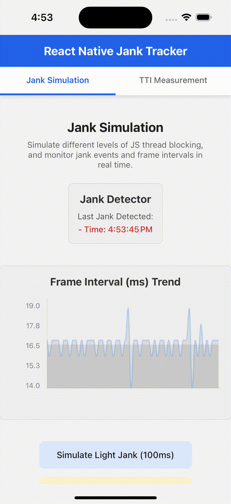
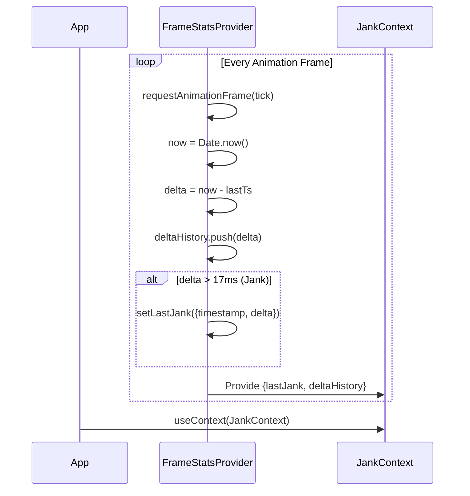
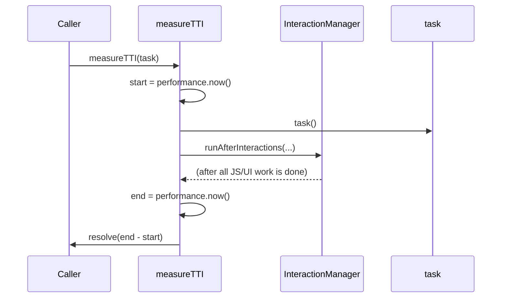

# React Native Jank Tracker

A lightweight library for tracking, visualizing, and simulating UI jank (frame drops) and measuring Time To Interactive (TTI) in React Native apps.

---

## Demo

- 

---

## Features

- **Jank & FPS Detection (JS-based)**: Detects and displays UI jank events and frame intervals (FPS) in real time, measured on the **JavaScript thread** (not native FPS).
- **Frame Graph**: Visualizes frame interval trends.
- **Jank Simulation**: Simulate various levels of JS thread blocking.
- **TTI Measurement (JS-based)**: Measure Time To Interactive (TTI) using InteractionManager for realistic results, based on the **JavaScript thread** (not native TTI).
- **Easy Integration**: Simple API.

---

## How it works / Architecture

### FrameStatsProvider (FPS & Jank Detection, JS thread)

**Core Principle:**

- Uses React Context API to provide real-time frame interval (FPS) and jank (frame drop) information throughout the app.
- **All measurements are performed on the JavaScript thread. This does NOT reflect native FPS.**
- Internally leverages `requestAnimationFrame` to measure frame intervals (Δt).
- If Δt exceeds 17ms (i.e., below 60FPS), it is considered a jank event and recorded.
- Provides recent frame interval history and the last jank event via context.

**Sequence Diagram (Mermaid):**



**Conceptual Overview:**

- Wrapping your app with FrameStatsProvider allows any child component to subscribe to frame/jank information via context.
- The frame interval history enables FPS graphs, jank event displays, and other visualizations.
- **All FPS/jank data is based on the JavaScript thread, not native rendering.**

### measureTTI (Time To Interactive Measurement, JS thread)

**Core Principle:**

- Executes a given task (function), then waits until the JS/UI thread is completely idle.
- **TTI is measured on the JavaScript thread, not native TTI.**
- Measures the elapsed time from task start to idle as the TTI.
- Uses React Native's `InteractionManager.runAfterInteractions` to detect the idle point.
- Uses high-resolution timer (`performance.now()`) for accurate measurement.

**Sequence Diagram (Mermaid):**



**Conceptual Overview:**

- `measureTTI` measures "the time from user interaction until the app is fully interactive again (on the JS thread)."
- It accurately captures the point when all rendering, animation, and heavy JS work is finished **on the JavaScript thread**.
- **This does NOT reflect native TTI or native rendering pipeline.**

---

## Installation

```bash
yarn add react-native-jank-tracker
# or
npm install react-native-jank-tracker
```

---

## Quick Start

1. **Wrap your app with the provider (required for jank/frame context):**

```tsx
import FrameStatsProvider from 'react-native-jank-tracker/FrameStatsProvider';

const App = () => <FrameStatsProvider>{/* ...your app... */}</FrameStatsProvider>;
```

- `FrameStatsProvider` tracks frame intervals (FPS) and jank (frame drops) in real time, and provides this data via context. **All measurements are JS-based.**

2. **Measure TTI for a task:**

```tsx
import { measureTTI } from 'react-native-jank-tracker';

async function handleTTI() {
  const tti = await measureTTI(() => {
    // ...simulate heavy work or render...
  });
  console.log('TTI:', tti, 'ms');
}
```

> **Note:** `measureTTI` does **not** require the Provider. However, if you want to use jank/frame context (`JankContext`), you must wrap your app with `FrameStatsProvider`.
> **Note:** All TTI measurements are JS-based and do not reflect native TTI.

---

## API

### `FrameStatsProvider`

Wraps your app and provides frame interval (FPS) and jank (frame drop) data via context. Required if you want to use `JankContext` or visualize frame/jank data globally. **All data is JS thread-based.**

### `measureTTI(task)`

Measures Time To Interactive (TTI) for a given synchronous task using **InteractionManager**. **This is a JS thread-based TTI, not native.**

- **Parameters:**
  - `task`: A synchronous function to execute and measure (e.g. rendering, heavy computation)
- **Returns:**
  - `Promise<number>`: The measured TTI in milliseconds

#### **Example**

```tsx
import { measureTTI } from 'react-native-jank-tracker';

async function handleTTI() {
  const tti = await measureTTI(() => {
    // ...simulate heavy work or render...
  });
  console.log('TTI:', tti, 'ms');
}
```

- The function uses `performance.now()` for high-resolution timing.
- It always waits for all UI/JS work to finish before stopping the timer (using `InteractionManager.runAfterInteractions`).
- **All timing is based on the JavaScript thread, not native.**

### `JankContext`

Access frame/jank data anywhere in your app (requires Provider). **All data is JS thread-based.**

---

## Example App

A full-featured example app is included in the `example/` directory. It demonstrates:

- Real-time jank and FPS detection and frame graph (JS thread)
- Jank simulation buttons
- TTI measurement (JS thread)

To run the example:

```bash
cd example
# iOS
yarn ios
# Android
yarn android
```

---

## Requirements

- React Native 0.79+
- React 19+

---

## Troubleshooting

### Metro server port already in use

If you see an error like:

```
error listen EADDRINUSE: address already in use :::8081
```

It means another Metro server is already running. You can stop it with:

```bash
lsof -i :8081
# Find the PID and kill it:
kill -9 <PID>
```

Or simply close any other running Metro/React Native dev servers.

---

## License

MIT
